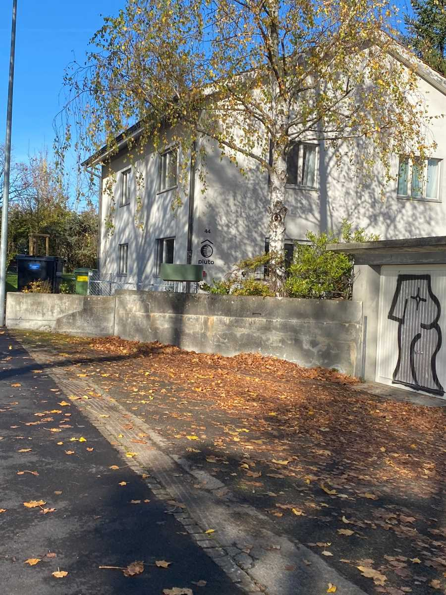
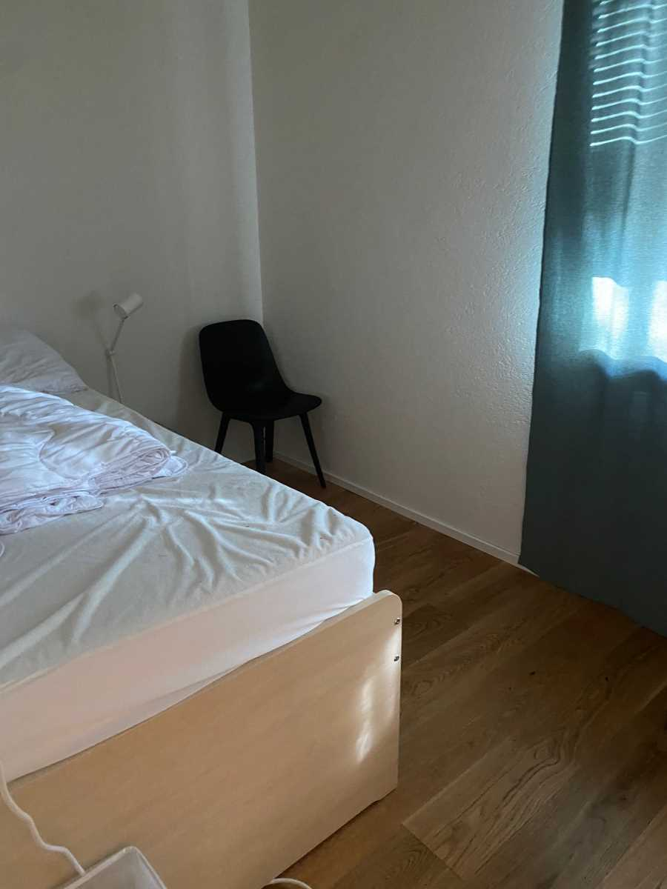
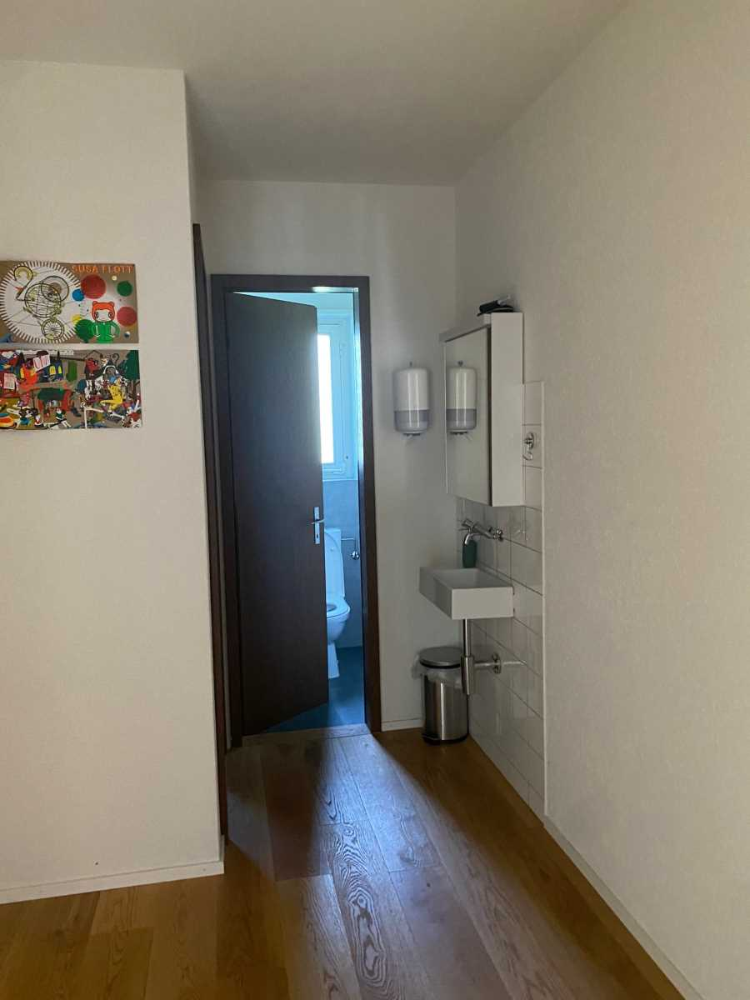

+++
title = "Wohin? Dahin! Notschlafstellen. "
date = "2022-12-22"
draft = true
pinned = false
tags = ["Deutsch", "Reportage"]
image = "lol.jpeg"
description = "\nWas machen, wenn man von zuhause einfach mal wegmuss? Wohin wenn man eine Nacht lang verschwinden will? Auf der Suche nach Antworten habe ich mich nach Bern an die Studerstrasse 44 bewegt, wo sich die Notschlafstelle Pluto befindet. \n"
+++
**Eine Reportage von Nathalie Schürmann**

Sobald meine Sachen gepackt waren, habe ich mein Haus verlassen und bin zur Bushaltestelle gelaufen. Jetzt sitze ich hier und warte auf den Bus. Streit ist etwas, was ich in meinem Leben nicht brauche und wenn ich weiss, dass es nichts bringt zu diskutieren gehe ich einfach raus. Damit der Streit nicht eskaliert, muss man manchmal weggehen, damit niemand verletzt wird. Wenn ich geblieben wäre, hätte ich meine Mutter verletzt, was nichts gebracht hätte, weshalb ich lieber gehe. Während ich hier sitze und auf den Bus warte, lasse ich meine Gedanken wandern. Was machen Jugendliche, welche von zuhause wegwollen, aber nirgends hinkönnen? Ich kann in solchen Fällen einfach von meiner Mutter zu meinem Vater oder umgekehrt. Jedoch können dies nicht alle Jugendliche. Und bei Freunden schlafen unter der Woche ist immer schwierig. Dazu fragen die Eltern der Freunde immer, ob die eigenen Eltern auch einverstanden sind. Wohin diese Jugendliche gehen, frage ich mich heute noch, weswegen ich auf Antworten Suche gehe. 
Auf der Suche nach Antworten bin ich auf die Notschlafstelle Pluto gestossen. Nach weiterer Recherche hat sich mein Interesse dafür verstärkt. Also habe ich entschieden, das Pluto-Team zu fragen, ob ich mit ihm ein Interview führen darf. Zum Glück haben sie ja geantwortet und am Montag, dem 7.11.2022 um 10:30 Uhr bin ich bei Pluto angekommen. Stéphanie Schäfges hat mich empfangen. Nach einer kurzen Tour haben wir uns an den Tisch gesetzt und das Interview gemacht.  

**Was sind Notschlafstellen?**

Notschlafstellen sind Unterkünfte für Personen, welche in Notsituationen einen Ort zum Schlafen brauchen. Je nach Notschlafstelle sind unterschiedliche Personengruppen im Fokus. Es gibt Notschlafstellen für Frauen, Jugendliche oder Obdachlose. Bei den meisten Notschafstellen muss man sich jeden Abend neu anmelden. Aus diesem Grund hat man nicht jeden Abend garantiert einen Platz. Bei wenigen Notschlafstellen kann man sich abonnieren, damit man jeden Tag sicher einen Platz hat. Es gibt jedoch auch Notschlafstellen, welche walk-in sind und keine Anmeldung erfordern. Pluto ist so eine. Man kann ohne Anmeldung hingehen und sie nehmen einen auf. 

Notschlafstellen unterscheiden sich von Notunterkünften dadurch, dass sie nur nachtsüber geöffnet sind und nicht einen längerfristigen Aufenthalt ermöglichen. Zudem gibt es keine Privatsphäre, da alle zusammen in einem grossen Raum schlafen. Wenn es mal eine Trennung gibt, ist es nur eine Geschlechtstrennung. Oft gibt es jedoch Duschen und Badezimmer. Bei einigen Notschlafstellen gibt es aber zudem die Möglichkeit eines Morgen- und Nachtessens. 

> *«Denn schliesslich entscheiden sie, wie sie fortfahren wollen.»*
>
> *\-Stéphanie Schäfges*

**Was und wer ist Pluto?**

Pluto ist eine Jugendnotschlafstelle in Bern, die seit dem 27.5.2022 offen ist. In dieser kurzen Zeit haben bereits 35 Personen dort geschlafen. Sie befindet sich an der Studerstrasse 44. Die Notschlafstelle bietet Schutz und eine Unterkunft für Jugendliche und junge Erwachsene zwischen 14 und 23 Jahren. Sie ist zwischen 18:00 und 09:00 Uhr geöffnet. Während den Öffnungszeiten sind von den acht Mitarbeitern und Mitarbeiterinnen immer mindestens zwei vor Ort. Im Gespräch mit Stéphanie erfahre ich, dass vier der Mitarbeiter und Mitarbeiterinnen Fachpersonen der Sozialen Arbeit und vier Profis in ihrem eigenen sozialwissenschaftlichen Bereich sind. Somit sind alle angestellten Personen ausgebildet, die Jugendlichen und junge Erwachsene zu beraten, falls dies notwendig oder gefragt ist. Pluto bietet den Jugendlichen und jungen Erwachsenen nämlich nicht nur eine Unterkunft, sondern auch Hilfe an, eine individuelle und möglichst nachhaltige Lösung für ihre Probleme zu finden. Hierbei können die Jugendliche und junge Erwachsene selber entscheiden, wer worüber informiert wird. Als ich gefragt habe, ob dies auch bei häuslicher Gewalt so sei, hat Stéphanie mir erklärt, dass bei Erwachsenen die Entscheidung bei ihnen liegt. «Wir können sie unterstützen und beraten, aber wir wollen niemanden in irgendetwas reindrängen.» Bei Minderjährigen jedoch müssen nach zwei Tagen die Eltern oder der Vormund informiert werden, wo das Kind/die betreute Person ist. Wenn nun häusliche Gewalt vermutet oder bestätigt wird, können die Mitarbeiter und Mitarbeiterinnen auch die KESB (Kinder- und Erwachsenenschutz Behörde) oder andere involvierte Personen informieren. Dies war jedoch bis jetzt noch nicht notwendig, weil immer bereits jemand involviert war. Es ist auch möglich, die Notschlafstelle zu besuchen und ein Gespräch zu führen, ohne die Nacht zu verbringen. 

**Wo gibt es Notschlafstellen? Wer darf dorthin? Wieso geht man dorthin?**

Es gibt viele Notschlafstellen, die überall der Welt verteilt sind. Alleine in Bern gibt es über 100 Notschlafplätze. Notschlafstellen sind ein weltweites Konzept. (Jedoch verändern sich kleine Sachen und Regeln von Land zu Land.) In Amerika z.B. sind Notschlafstellen als Homeless-Shelters bekannt. Jede Notschlafstelle hat ihre eigene Kategorie und jeder und jede darf dorthin, wenn er oder sie dieser angehört. Zum Beispiel gibt es welche nur für Frauen, welche nur für nicht Junkies, welche nur für Junkies, welche nur für Jugendliche und so weiter. Diese Einschränkungen können jedoch zu Problemen führen. Wenn z.B. eine transsexuelle Frau in eine Notschlafstelle für Frauen will, kann es sein, dass sie abgelehnt wird und eine andere Lösung suchen muss oder schlimmstenfalls die Nacht auf der Strasse verbringen muss. 

Es gibt viele Gründe, wieso eine Person das Bedürfnis hat, zu einer Notschlafstelle zu gehen. Diese Gründe können von Situation zu Situation variieren. Bei einem Jugendlichen kann es sein, dass er oder sie von zuhause wegmuss, um eine Pause zu haben. Oder auch wenn zuhause oder anderswo Missbrauch betrieben wird, sei es physisch oder psychisch. Oft kann es auch eine Kombination von mehreren Faktoren sein. Bei Erwachsenen kann dies viel mehr variieren. Von Problemen bei der Arbeit, über Obdachlosigkeit, zu einer Scheidung von welcher sie eine Pause brauchen. Bei Pluto waren bis jetzt Konflikt zu Hause / in der Pflegefamilie, Ausschluss aus betreutem Wohnen/Asylunterkunft/Kollektivunterkunft, Arbeitssuche/Migration, Kurve, Suchtproblematik die Nutzungsgründe. 

> *"Man darf kommen, wenn man Betrunken ist, gekifft hat oder andere Drogen konsumiert hat."*
>
> *\-Stéphanie Schäfges*

**Soziale Hilfe bei Notschlafstellen**

Bei manchen Notschlafstellen sind Experten dort, damit die Besucher professionelle Hilfe erhalten können. Diese sind dort, um mit den Besuchern eine effektive und nachhaltige Lösung zu ihren Problemen zu finden. Dies ist kostenfrei und die Experten werden von der Notschlafstelle oder vom Staat bezahlt, doch mehr zu den Finanzen weiter unten im Text. Die Experten helfen die Besucher Lösungen zu finden, jedoch können sie die Besucher nicht zwingen etwas zu tun. Stéphanie hat mir erklärt, dass sie nur bei Minderjährigen jemanden nach zwei Tagen informieren müssen. Bei Erwachsenen hingegen machen sie nur, was die Person wünscht. «Wir können sie unterstützen und beraten, aber wir wollen niemanden in irgendetwas reindrängen.»

Bei Minderjährigen ist dies jedoch anders. Da müssen nach 48h die Eltern, ein Vormund oder eine Organisation wie die KESB informiert werden. Davor besprechen die Mitarbeiter oder Experten mit dem jugendlichen Besucher, über was die Eltern, Vormünder oder KESB informiert werden sollen. Wo sich der Jugendliche oder die Jugendliche befindet, muss den Eltern oder Vormünder gesagt werden. Wieso der oder die Betroffene dort ist, hingegen, müssen die Eltern oder Vormünder oder KESB nicht erfahren, wenn der oder die Betroffen dies nicht will.

**Letztens**

Ich habe dank Stéphanie Schäfges und dem Pluto-Team viel über die Notschlafstelle Pluto erfahren. Ich hoffe sehr, dass Pluto weiterhin Erfolg hat. Auch hoffe ich, mit dieser Reportage auf Notschlafstellen aufmerksam zu machen. Pluto wird durch Spenden finanziert. Seien dies in der Form von alten Kleidern oder Geld. Das nächste Mal, dass sie ausmisten, freuen sie sich sicher über ein Paar Jeans oder einen Pulli. Zusätzlich bin ich sehr froh erfahren zu haben, wohin Jugendliche und junge Menschen hinkönnen, falls sie mal von zuhause wegmüssen. Denn jeder, inklusive mich, braucht mal eine Pause vom Alltag.